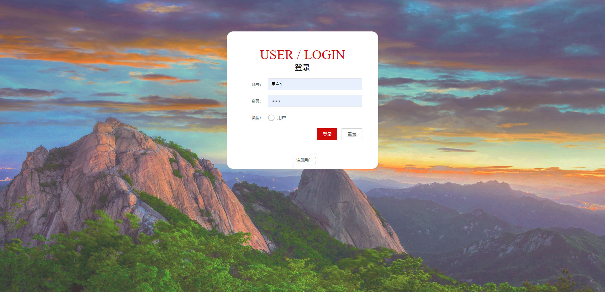
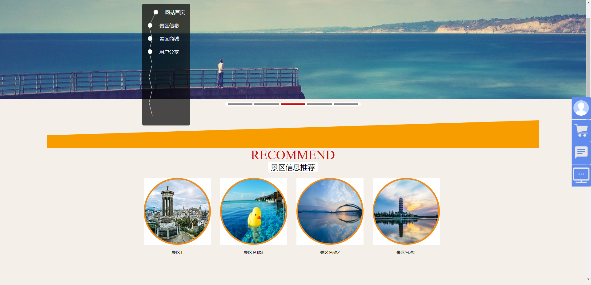
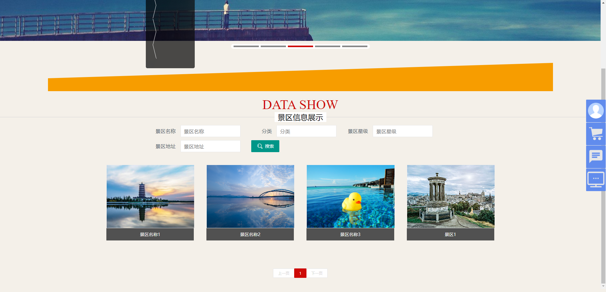
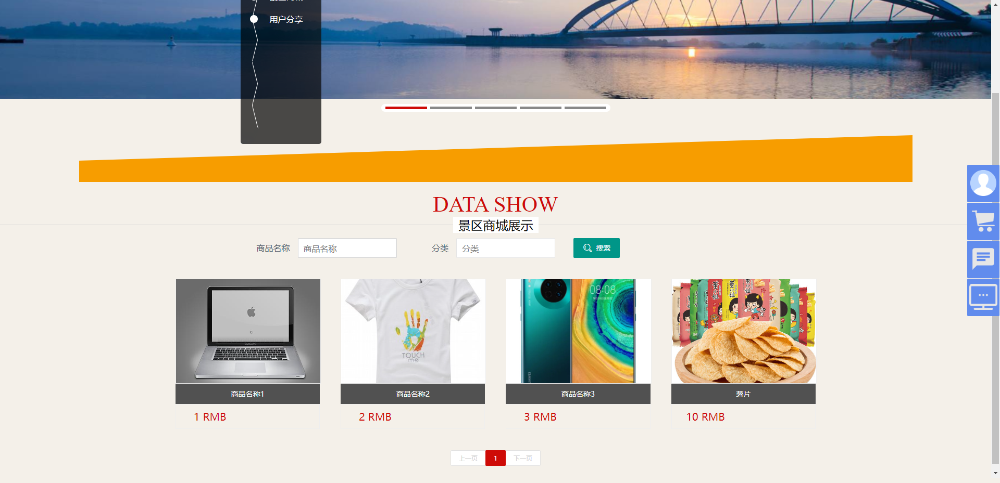
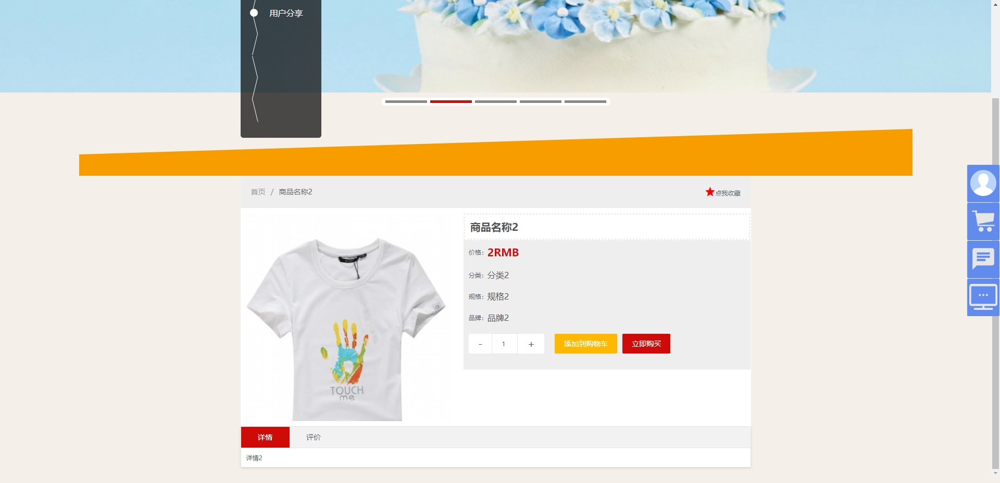
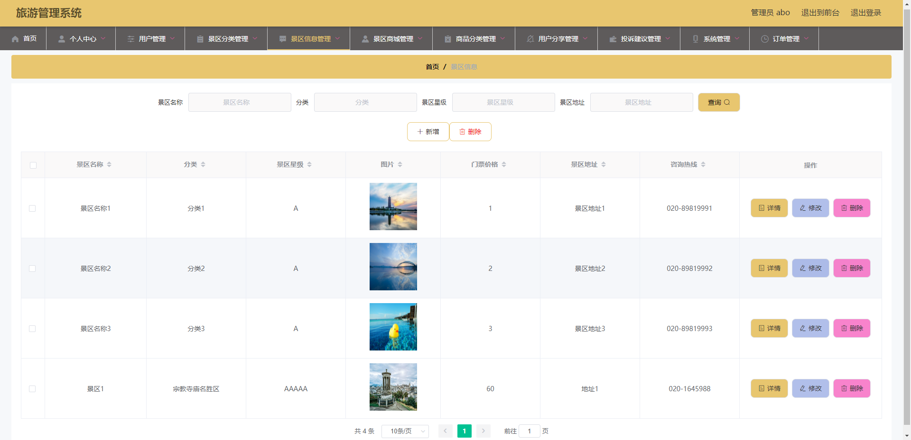
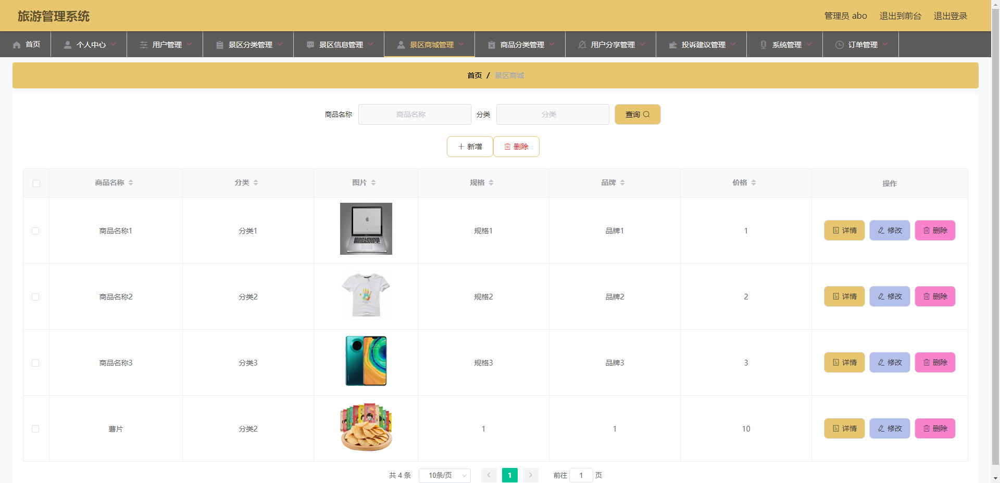
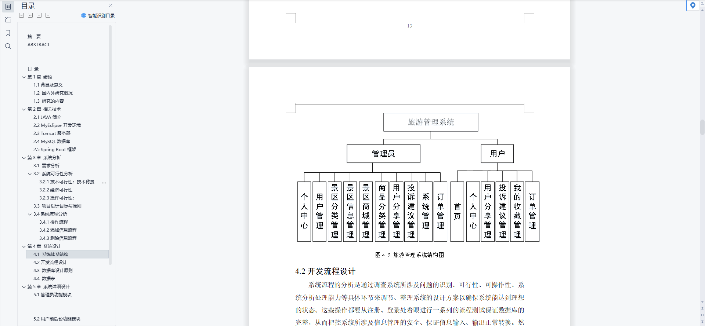
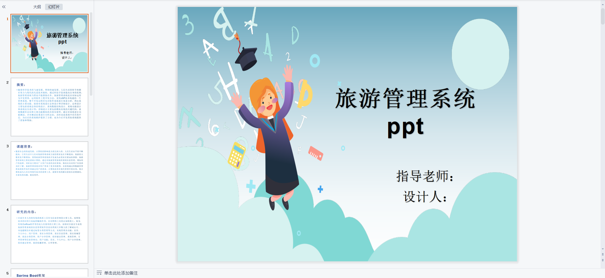
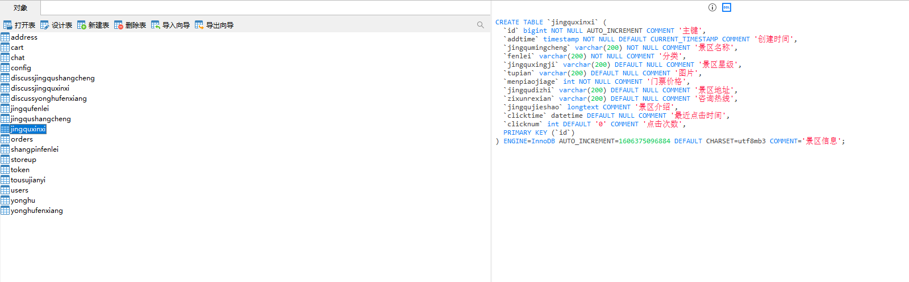

# 1 项目介绍
基于SSM+Vue的景区管理系统：后端 SpringBoot、Mybatis-Plus，前端Vue+ElementUI，具体功能如下：
## 管理端
- 个人中心：查看和修改个人信息、修改密码
- 用户管理
- 景区类型管理
- 景区信息管理
- 景区商城管理
- 商品分类管理
- 用户分享管理
- 投诉建议管理
- 系统管理
- 订单管理
## 用户端
- 首页
- 个人中心
- 用户分享管理
- 投诉建议管理
- 我的收藏管理
- 订单管理
# 2 系统运行截图
## 2.1 用户登录

## 2.2 用户首页

## 2.3 景区信息列表

## 2.4 景区商城

## 2.5 商品详情

## 2.6 景点信息管理

## 2.7 景区商城管理

## 2.8 万字文档

## 2.9 PPT

# 3 数据库设计

# 4 源码数据库获取(收费)

